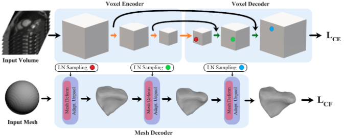
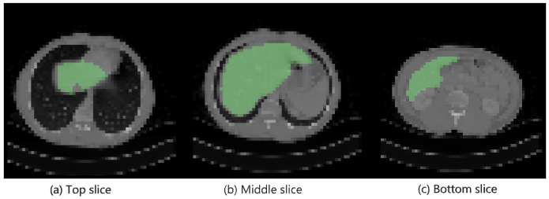

# Voxel2Mesh: 3D Mesh Model Generation from Volumetric Data

This repository of my Thesis called: "Volumetric Image Segmentation with low-resolution and Incomplete 3D Image Data"

## Abstract

This thesis explores innovative methods for segmenting 3D meshes from Magnetic Resonance Images (MRIs) and Computed Tomography (CT) scans, with a focus on developing efficient and cost-effective segmentation techniques suitable for the medical industry. 

To achieve these objectives, the thesis employs novel 3D volumetric segmentation architectures,  Voxel2Mesh and U-NET, to conduct a series of test cases. A significant focus is placed on the impact of data pre-processing on the analysis and generalizability of segmentation algorithm performance.  Through methodical experimentation and analysis, this thesis contributes to the field by offering insights into the optimization of segmentation techniques, ultimately aiming to improve the accessibility and quality of 3D mesh generation in healthcare settings. The findings have the potential to streamline clinical workflows, reduce operational costs, and enhance patient care by enabling more accurate and detailed anatomical representations.

## 3D Image Segmentation Models

### U-Net Architecture 

    

The figure shows the U-Net Architecture. The different colored arrows mean specific procedures; 
Red is a 3 x 3 Convolution, Yellow is a 2 x 2 Max Pooling, Black is a 1 x 1 Convolution, Green is a combination of 2 x 2 Transpose Convolution + Concatenation + 3 x 3 Double Convolution.

The U-Net architecture is a convolutional neural network (CNN) that was specifically designed for biomedical image segmentation tasks 

## Voxel2Mesh Architecture

    

The figure shows the V2M  model predicting the Right Ventricle Heart Segment. V2M takes in 3D input data and sphere mesh. Both inputs get encoders while providing information to each other during the process. Same hold true during the decoding phase. During each stage of mesh decoding, the decoder initially takes the current mesh and a collection of features sampled from the cube at the same resolution as input. Subsequently, the mesh undergoes non-uniform deformation and refinement, with vertices being added selectively only in areas where they are required.

The Voxel2Mesh model incorporates cutting-edge techniques such as Learned Neighborhood Sampling (LN Sampling) and Adaptive Mesh Unpooling (Adapt. Unpool) to efficiently convert voxel-based representations of 3D data into detailed mesh structures

## Datasets

Details of three datasets that we used for analysis during this project is explained. They are, Chaos challenge dataset, MSD (Decathlon) challenge dataset and ACDC challenge dataset.

### CHAOS Challenge Dataset

    

The figure shows Examples of contoured snapshots from a patient of the CHAOS Dataset. 
The green color segmentation comes from the Liver ground truth.
 Those are slices from the top (a), middle (b), and bottom (c) of the stack.

CHAOS (Combined Healthy and Abnormal Organ Segmentation) Challenge,  is a competition aimed at developing and evaluating algorithms for the segmentation of healthy and abnormal organs in medical imaging data
